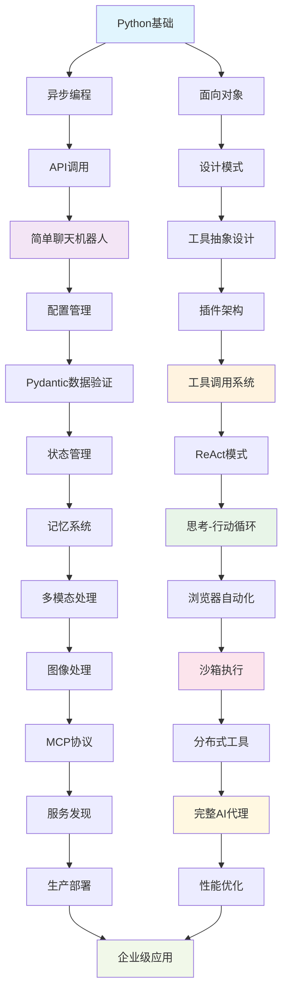
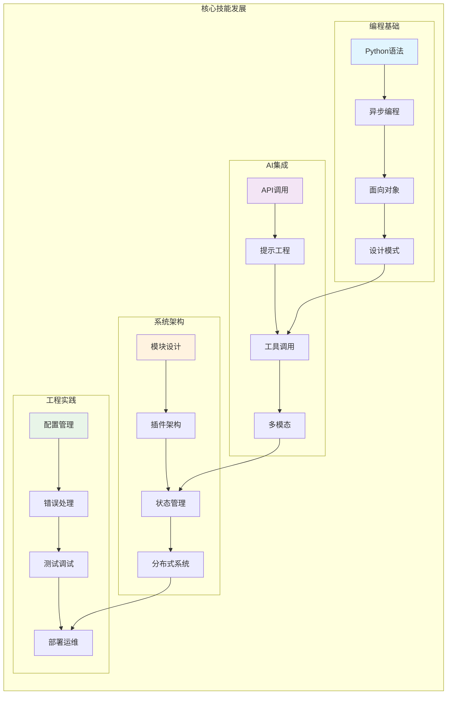
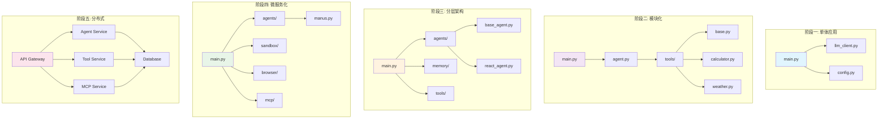

# OpenManus AI应用开发学习路径可视化

## 技能发展树

## 学习阶段时间线

```mermaid
gantt
    title OpenManus AI开发学习时间线
    dateFormat  X
    axisFormat %s周
    
    section 基础阶段
    Python基础强化     :a1, 0, 2
    简单聊天机器人     :a2, 0, 1
    配置驱动助手       :a3, 1, 2
    
    section 工具系统
    基础工具框架       :b1, 2, 3
    工具调用代理       :b2, 3, 5
    
    section ReAct模式
    思考-行动循环      :c1, 5, 7
    记忆和状态管理     :c2, 6, 8
    
    section 高级功能
    多模态代理         :d1, 8, 11
    沙箱执行环境       :d2, 9, 12
    
    section 分布式系统
    MCP协议实现        :e1, 12, 14
    服务器集成         :e2, 13, 15
    
    section 完整系统
    OpenManus简化版    :f1, 15, 19
    生产环境部署       :f2, 18, 20
```

## 项目复杂度递增图

```mermaid
flowchart LR
    subgraph "阶段一: 基础 (复杂度: ⭐)"
        A1[简单聊天机器人<br/>- OpenAI API<br/>- 基础配置<br/>- 错误处理]
        A2[配置驱动助手<br/>- Pydantic模型<br/>- TOML配置<br/>- 类型注解]
    end
    
    subgraph "阶段二: 工具系统 (复杂度: ⭐⭐)"
        B1[基础工具框架<br/>- 抽象基类<br/>- 插件架构<br/>- JSON Schema]
        B2[工具调用代理<br/>- LLM工具集成<br/>- 动态调用<br/>- 结果处理]
    end
    
    subgraph "阶段三: ReAct (复杂度: ⭐⭐⭐)"
        C1[ReAct循环<br/>- 状态机<br/>- 思考推理<br/>- 行动执行]
        C2[记忆管理<br/>- 对话历史<br/>- 上下文维护<br/>- 记忆压缩]
    end
    
    subgraph "阶段四: 多模态 (复杂度: ⭐⭐⭐⭐)"
        D1[多模态代理<br/>- 图像处理<br/>- 浏览器自动化<br/>- 文件操作]
        D2[沙箱环境<br/>- Docker容器<br/>- 安全隔离<br/>- 资源限制]
    end
    
    subgraph "阶段五: 分布式 (复杂度: ⭐⭐⭐⭐)"
        E1[MCP协议<br/>- 服务器实现<br/>- 客户端连接<br/>- 工具联邦]
        E2[分布式工具<br/>- 服务发现<br/>- 负载均衡<br/>- 故障恢复]
    end
    
    subgraph "阶段六: 完整系统 (复杂度: ⭐⭐⭐⭐⭐)"
        F1[OpenManus简化版<br/>- 完整架构<br/>- 所有功能集成<br/>- 性能优化]
        F2[生产部署<br/>- 容器化<br/>- 监控告警<br/>- 高可用]
    end
    
    A1 --> A2 --> B1 --> B2 --> C1 --> C2 --> D1 --> D2 --> E1 --> E2 --> F1 --> F2
    
    style A1 fill:#e3f2fd
    style B1 fill:#f3e5f5
    style C1 fill:#fff3e0
    style D1 fill:#e8f5e8
    style E1 fill:#fce4ec
    style F1 fill:#fff8e1
```

## 技能矩阵发展图

## 项目架构演进图

## 学习成果检验清单

### 阶段一检验点 ✅
- [ ] 能够独立调用OpenAI API
- [ ] 理解异步编程基本概念
- [ ] 会使用Pydantic进行数据验证
- [ ] 能够处理基本的配置管理
- [ ] 掌握Python类和继承

### 阶段二检验点 ✅
- [ ] 能够设计抽象基类
- [ ] 理解插件架构模式
- [ ] 会实现工具调用系统
- [ ] 掌握JSON Schema使用
- [ ] 能够处理动态工具加载

### 阶段三检验点 ✅
- [ ] 理解ReAct模式原理
- [ ] 能够实现状态机
- [ ] 会设计记忆管理系统
- [ ] 掌握循环控制和终止条件
- [ ] 能够处理上下文维护

### 阶段四检验点 ✅
- [ ] 会使用Playwright进行浏览器自动化
- [ ] 能够处理图像和多模态数据
- [ ] 掌握Docker容器化技术
- [ ] 理解沙箱安全隔离
- [ ] 会进行资源管理和清理

### 阶段五检验点 ✅
- [ ] 理解MCP协议原理
- [ ] 能够实现服务器和客户端
- [ ] 会设计分布式工具系统
- [ ] 掌握服务发现和注册
- [ ] 能够处理网络通信和错误恢复

### 阶段六检验点 ✅
- [ ] 能够设计完整的AI代理架构
- [ ] 掌握性能优化技巧
- [ ] 会进行生产环境部署
- [ ] 理解监控和运维
- [ ] 能够独立开发复杂AI应用

## 常见问题和解决方案

### Q1: 学习过程中遇到困难怎么办？
**A1**: 
- 回到上一个阶段，确保基础扎实
- 查看官方文档和示例代码
- 在开发者社区寻求帮助
- 通过调试和日志分析问题

### Q2: 如何验证学习效果？
**A2**:
- 完成每个阶段的项目实现
- 通过单元测试验证功能
- 与同行进行代码审查
- 尝试解决实际业务问题

### Q3: 学习时间安排建议？
**A3**:
- 每天至少2-3小时编程实践
- 每周完成一个小项目
- 定期回顾和总结
- 保持持续学习的节奏

### Q4: 如何选择合适的技术栈？
**A4**:
- 根据项目需求选择
- 考虑团队技术背景
- 评估学习成本和维护成本
- 关注技术的发展趋势

## 学习资源推荐

### 官方文档
- [OpenAI API文档](https://platform.openai.com/docs)
- [Pydantic文档](https://docs.pydantic.dev/)
- [FastAPI文档](https://fastapi.tiangolo.com/)
- [Playwright文档](https://playwright.dev/python/)

### 开源项目
- [OpenManus](https://github.com/FoundationAgents/OpenManus)
- [LangChain](https://github.com/langchain-ai/langchain)
- [AutoGPT](https://github.com/Significant-Gravitas/AutoGPT)
- [CrewAI](https://github.com/joaomdmoura/crewAI)

### 学习社区
- GitHub Discussions
- Stack Overflow
- Reddit r/MachineLearning
- Discord AI开发者社区

通过这个可视化的学习路径，你可以清楚地看到每个阶段的技能发展、项目复杂度递增以及最终的学习成果。记住，学习是一个循序渐进的过程，每个阶段都有其独特的价值和挑战。