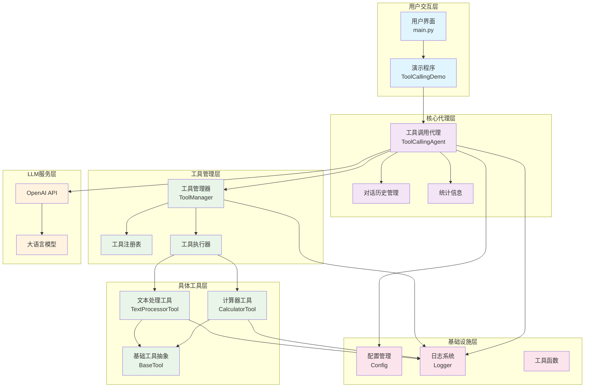
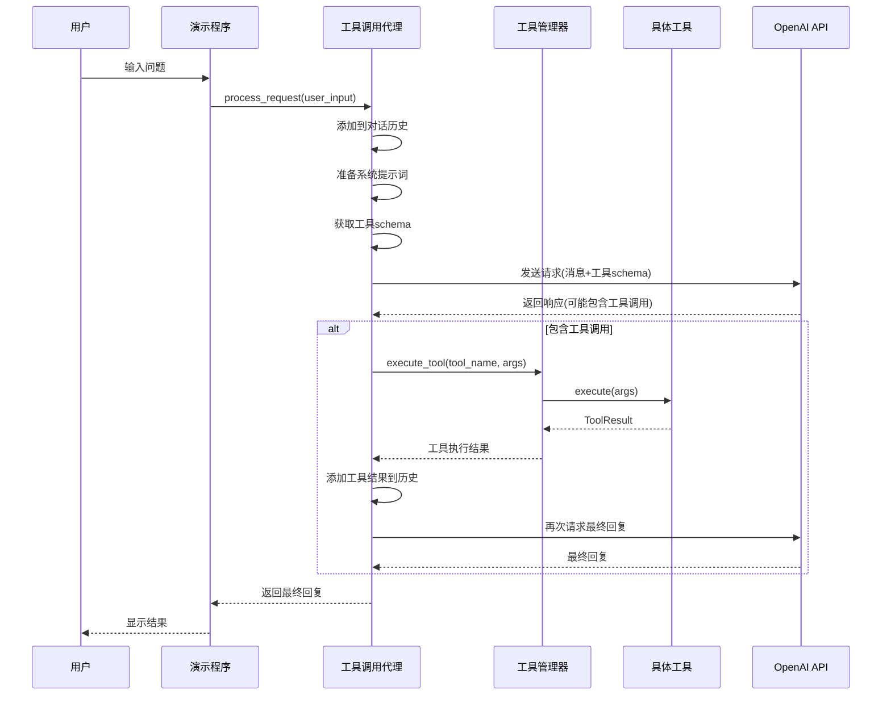
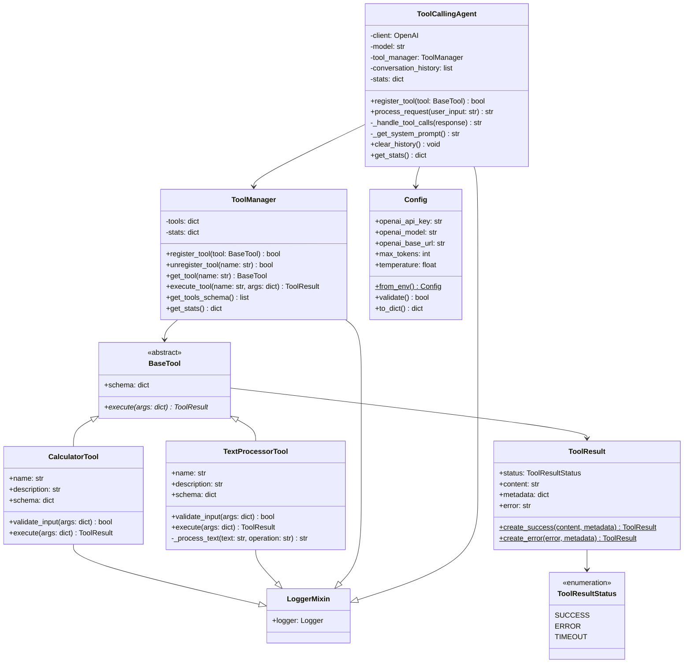
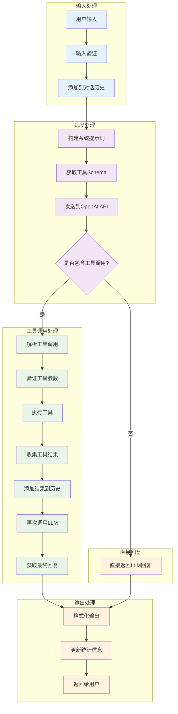
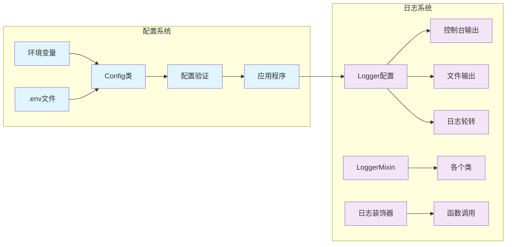
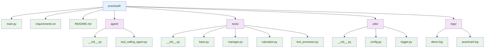

# Practical4 项目架构图表

## 1. 整体系统架构图

## 2. 工具调用流程图

## 3. 类关系图

## 4. 数据流图

## 5. 配置和日志系统架构

## 6. 项目文件结构

## 架构特点总结

### 1. 分层架构

- **用户交互层**: 处理用户输入和输出展示
- **核心代理层**: 管理对话流程和 LLM 交互
- **工具管理层**: 统一管理和调度各种工具
- **具体工具层**: 实现具体的功能工具
- **基础设施层**: 提供配置、日志等支撑服务

### 2. 设计模式应用

- **抽象工厂模式**: BaseTool 抽象基类
- **策略模式**: 不同工具的不同执行策略
- **单例模式**: Config 配置管理
- **装饰器模式**: 日志装饰器
- **混入模式**: LoggerMixin 提供日志功能

### 3. 异步编程

- 全面使用 async/await 处理异步操作
- 支持并发工具调用
- 非阻塞的用户交互

### 4. 错误处理和日志

- 完善的异常处理机制
- 分级日志记录
- 统计信息收集

这个架构设计体现了现代 Python 应用的最佳实践，为构建可扩展的 AI 代理系统提供了良好的基础。
