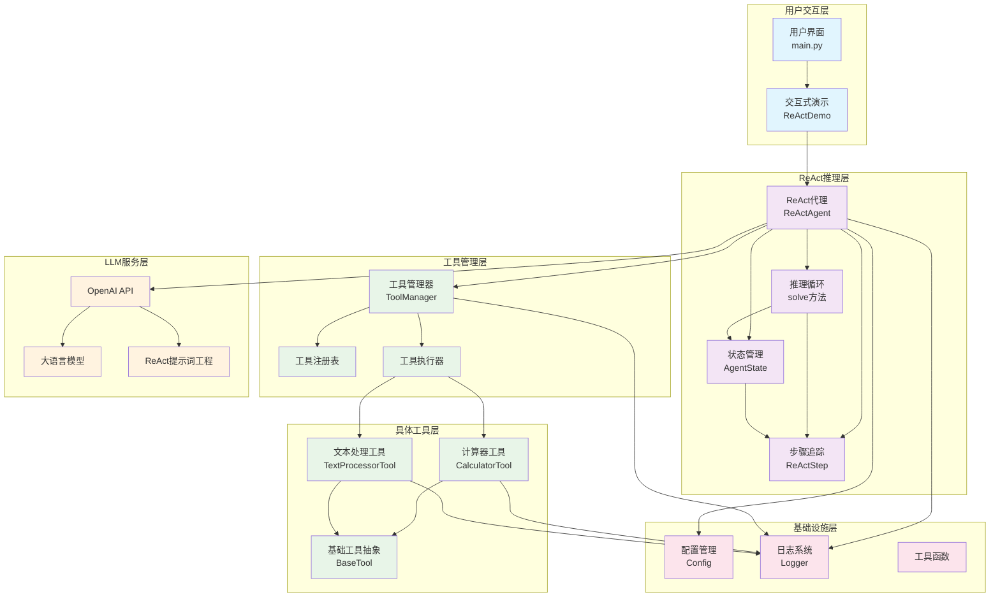
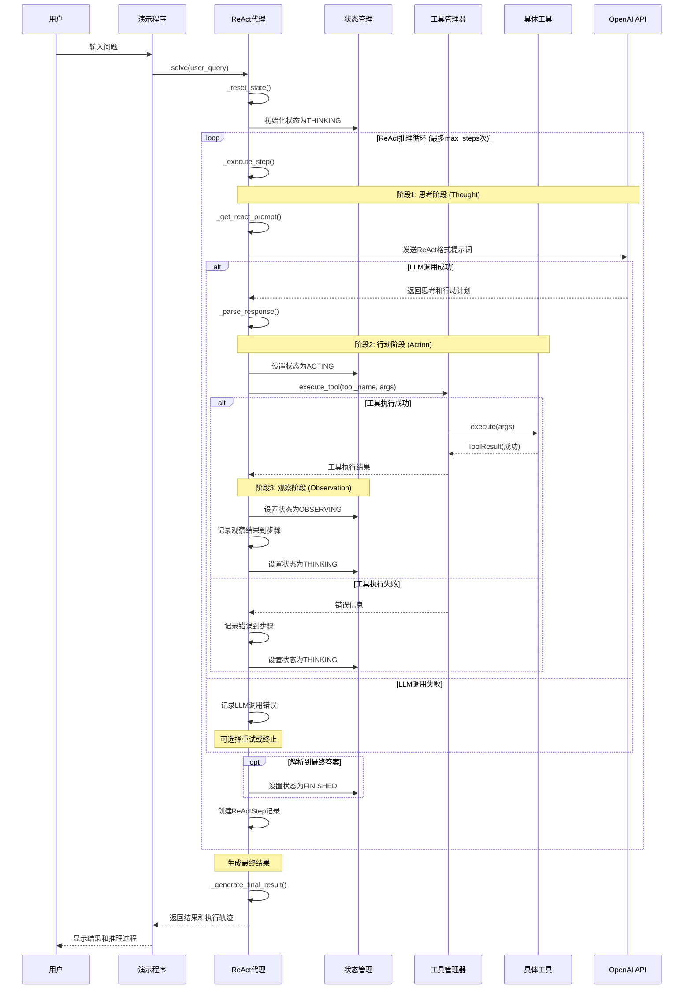
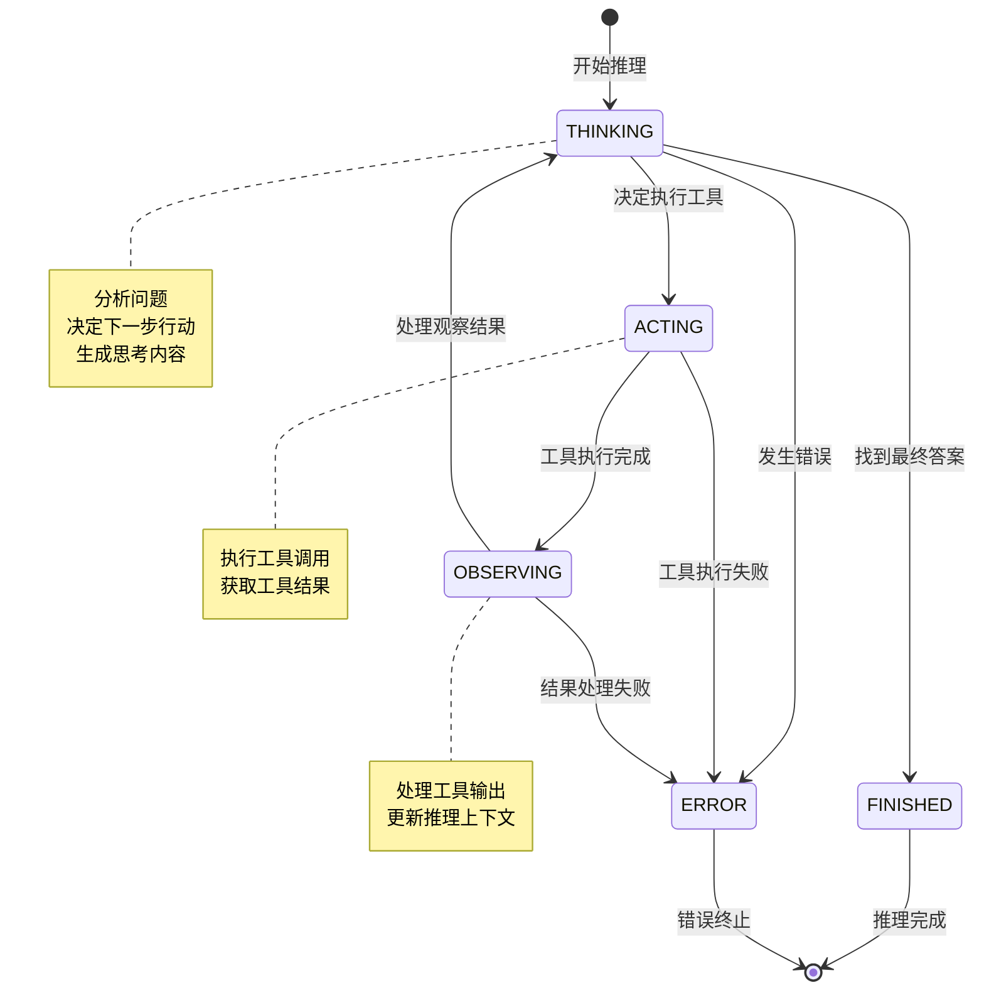
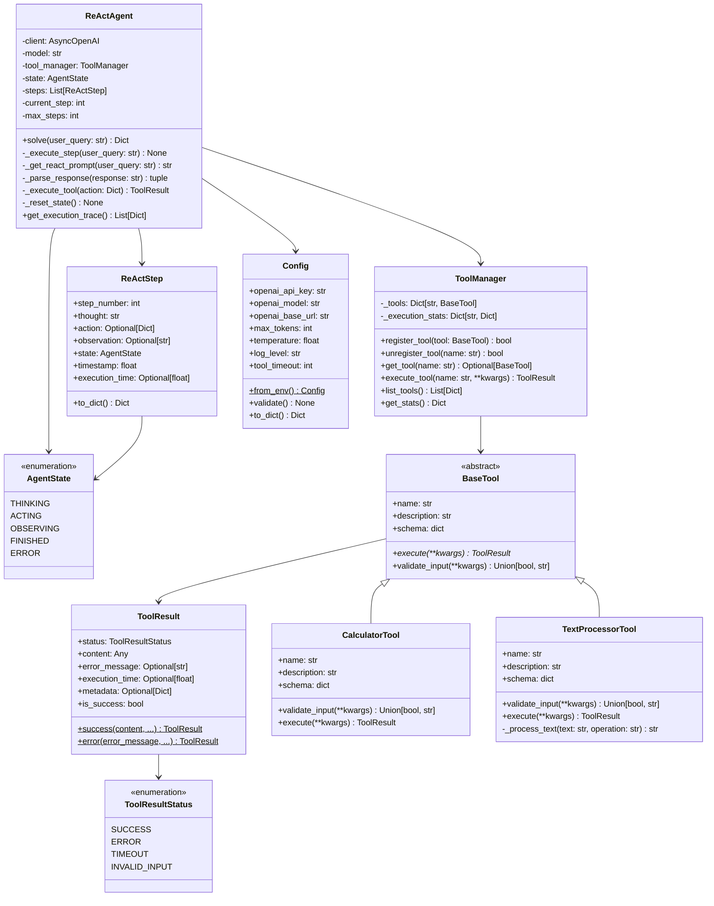
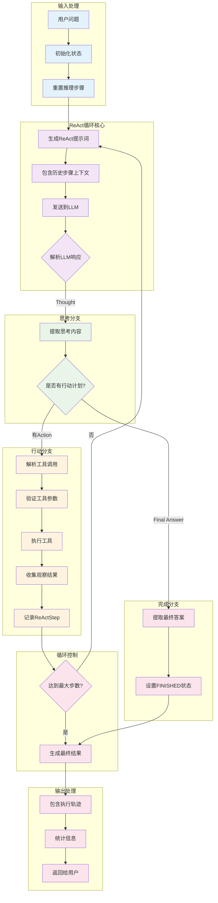
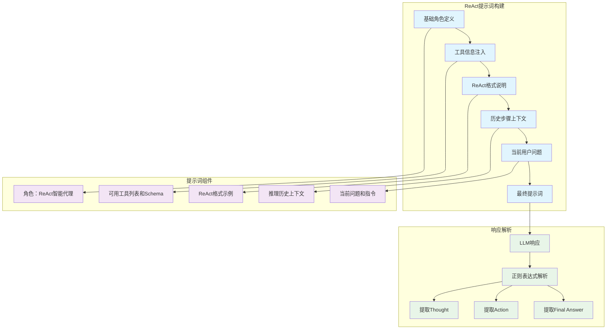

# Practical5 项目架构图表

## 1. 整体系统架构图

## 2. ReAct 推理流程图

## 3. ReAct 状态机图

## 4. 类关系图

## 5. ReAct 推理数据流图

## 6. 提示词工程架构

## 7. 项目文件结构

```mermaid
graph TD
Root[practical5/] --> Main[main.py]
Root --> Demo[demo.py]
Root --> Req[requirements.txt]
Root --> README[README.md]

Root --> Agent[agent/]
Agent --> AgentInit[__init__.py]
Agent --> ReactAgent[react_agent.py]

Root --> Tools[tools/]
Tools --> ToolsInit[__init__.py]
Tools --> Base[base.py]
Tools --> Manager[manager.py]
Tools --> Calc[calculator.py]
Tools --> Text[text_processor.py]

Root --> Utils[utils/]
Utils --> UtilsInit[__init__.py]
Utils --> Config[config.py]
Utils --> Logger[logger.py]

Root --> Tests[tests/]
Tests --> TestsInit[__init__.py]
Tests --> TestReact[test_react_agent.py]

Root --> Logs[logs/]
Logs --> MainLog[main.log]

classDef rootStyle fill:#e3f2fd
classDef moduleStyle fill:#f3e5f5
classDef fileStyle fill:#e8f5e8

class Root rootStyle
class Agent,Tools,Utils,Tests,Logs moduleStyle
class Main,Demo,Req,README,AgentInit,ReactAgent,ToolsInit,Base,Manager,Calc,Text,UtilsInit,Config,Logger,TestsInit,TestReact,MainLog fileStyle
```

## 架构特点总结

### 1. ReAct 模式核心特征

- **循环推理**: 实现了完整的"思考-行动-观察"循环
- **状态管理**: 清晰的状态机设计，追踪推理过程
- **步骤追踪**: 详细记录每个推理步骤，便于调试和分析
- **提示词工程**: 专门设计的 ReAct 格式提示词

### 2. 与项目 4 的主要差异

| 特性         | 项目 4 (ToolCallingAgent) | 项目 5 (ReActAgent) |
| ------------ | ------------------------- | ------------------- |
| **推理模式** | 单次工具调用              | 循环推理过程        |
| **状态管理** | 简单对话历史              | 复杂状态机          |
| **执行轨迹** | 基本统计信息              | 详细步骤记录        |
| **提示词**   | 工具调用格式              | ReAct 专用格式      |
| **错误处理** | 基础异常处理              | 状态感知恢复        |

### 3. 设计模式应用

- **状态机模式**: AgentState 枚举和状态转换逻辑
- **策略模式**: 不同状态下的不同处理策略
- **观察者模式**: 步骤追踪和日志记录
- **工厂模式**: ToolResult 的创建方法
- **模板方法模式**: ReAct 推理循环的固定流程

### 4. 技术亮点

- **异步编程**: 全面使用 async/await 提升性能
- **类型注解**: 完整的类型提示增强代码可读性
- **数据类**: 使用@dataclass 简化数据模型定义
- **枚举类型**: 类型安全的状态和结果状态定义
- **正则表达式**: 智能解析 LLM 的结构化响应

### 5. 可扩展性设计

- **模块化架构**: 清晰的层次分离，便于扩展
- **插件化工具**: 基于 BaseTool 的工具系统
- **配置驱动**: 灵活的配置管理系统
- **日志系统**: 完善的调试和监控支持

这个架构设计体现了 ReAct 推理模式的核心思想，为构建更智能、更可解释的 AI 代理系统提供了坚实的基础。相比项目 4 的简单工具调用，项目 5 实现了真正的循环推理能力，能够处理更复杂的多步骤问题。
